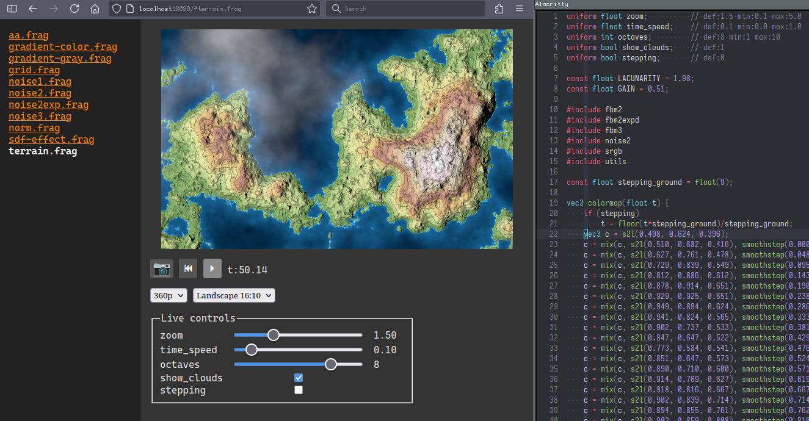

# Shader Workshop

This tool is a local HTTP/WebSocket server monitoring the specified shader
fragment directory. It allows live coding fragment shaders with your preferred
code editor, and having them rendered in your browser through WebGL2.



## Features

- Hot reload
- Live controls for basic uniforms
- Mouse position
- `#include` directive
- Play/Pause/Reset time
- Screenshot
- Resolution and aspect ratio controls
- Lightweight, no web dependencies

## Install

```sh
pipx install shader-workshop
```

`pip` can also be used.

## Usage

```
sw-server /path/to/fragment/shaders
```

If unspecified, `sw-server` will use the examples directory.

All the `.frag` files in that directory will be tracked and accessible through
the web interface.

## Fragment inputs and outputs

Every fragment gets the following uniforms as input:

- `float time`: the time in seconds
- `vec2 resolution`: the canvas resolution in pixels

They must write on the `vec4 out_color` output to produce a color.

The compatibility is currently set to `300 es`.

## Live controls

To expose controls to the web UI, declare a uniform in your fragment shader.
Optionally, in the comment beside, you can specify the default value and ranges.
For example:

```glsl
uniform float angle; // def:0.7 min:0.6 max:0.9
uniform int steps;   // def:7 min:0 max:10
uniform bool debug;  // def:1
uniform vec3 color;  // def:1,0.5,0
```

Currently, `float`, `int`, `bool` and `vec3` (for colors only) are supported.

## Includes

It is possible to include `.glsl` files using an `#include` directive:
`#include name` (no quote nor explicit `.glsl`). Recursive includes (`.glsl`
including `.glsl`) are supported, as well as including multiple times the same
file (through recursion or not). Their changes are also monitored by the file
watcher.
